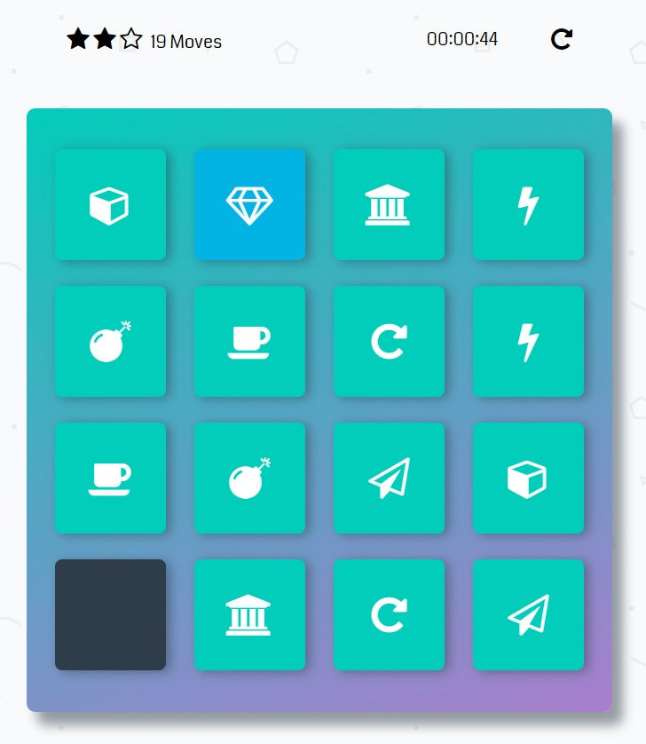

# Memory Game Project

## Table of Contents

* [About](#About)
* [Screenshots](#Screenshots)
* [Instructions](#Instructions)

## About

* This Project is made as a part of Udacity's Front-End Development Nanodegree.
* This is a Card-matching game as provided in the screenshot

## Screenshots

## Instructions

* The game starts automatically upon page load.
* Click a card to reveal it
* The goal is to reveal cards two at a time to match the pairs.
* The game ends when all of the 8 pairs are revealed.
* The game has no time limit

### Scoring

3 stars = 12 moves or less  
2 stars = 20 moves or less  
1 star = more than 20 moves